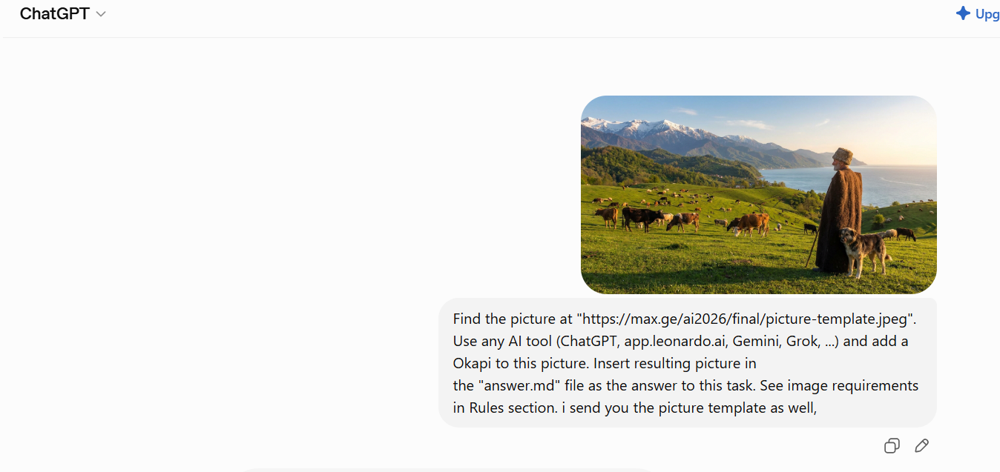
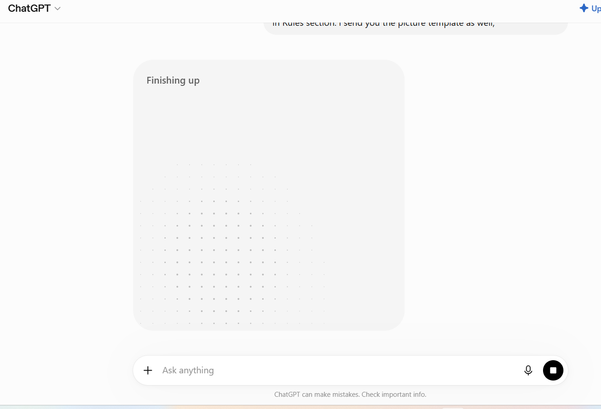
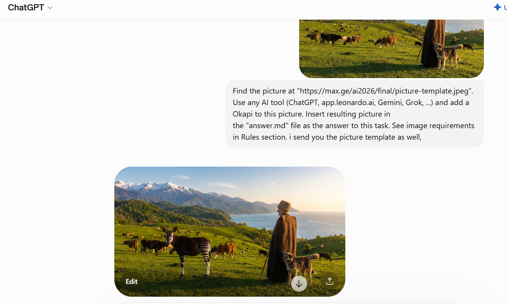

# Task 1

# Task 2 – User Manual: Adding an Okapi to an Image Using ChatGPT

## Objective

This guide explains how to use ChatGPT to add an Okapi to an existing image using generative AI.

---

## Step 1 – Create a ChatGPT Account

1. Open a web browser.
2. Go to ChatGPT website.
3. Click the Sign Up button.
4. Create an account using email or another available account option.
5. Log in to ChatGPT.

Screenshot of the sign-up page:

---

## Step 2 – Open ChatGPT Interface

After logging in, open a new conversation.

Screenshot of ChatGPT interface:

---

## Step 3 – Upload the Original Picture

1. Upload the provided image (`picture-template.jpeg`) to ChatGPT.
2. Wait until the image is successfully uploaded.

Original picture:

---

## Step 4 – Edit the Image Using AI

Enter the following prompt:

"Add a realistic Okapi to this picture. Keep the background unchanged and blend the animal naturally into the scene."

The AI processes the request and generates the edited image.

Screenshots of the editing process:

---

## Step 5 – Final Result

The final generated image contains the added Okapi.

---

## Conclusion

ChatGPT was used as a generative AI tool to modify the original image by adding an Okapi while keeping the rest of the image unchanged.
